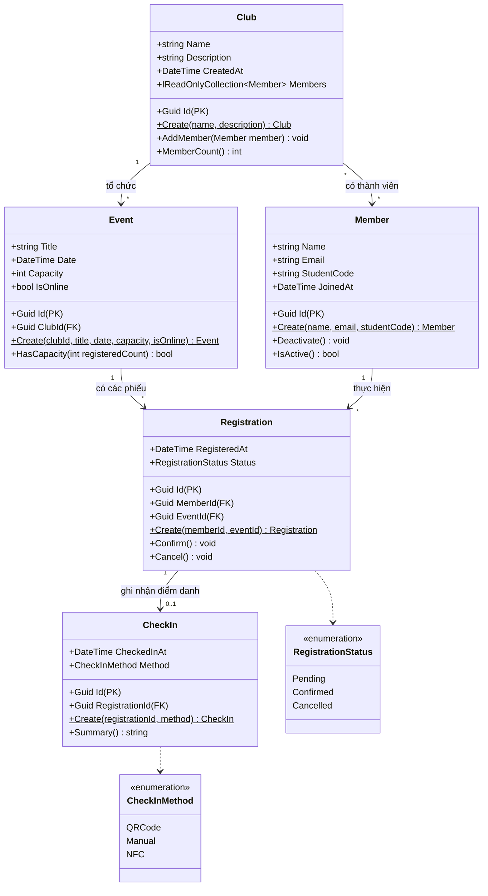

# Sơ đồ lớp sơ bộ (Class Diagram) - EduHub

Sơ đồ thể hiện cấu trúc domain model của hệ thống EduHub gồm 5 class chính: `Member`, `Club`, `Event`, `Registration`, và `CheckIn`[cite: 2].

```mermaid
classDiagram
    direction TB

    class Member {
        +Guid Id (PK)
        +string Name
        +string Email
        +string StudentCode
        +DateTime JoinedAt
        +Create(name, email, studentCode)$ Member
        +Deactivate() void
        +IsActive() bool
    }

    class Club {
        +Guid Id (PK)
        +string Name
        +string Description
        +DateTime CreatedAt
        +IReadOnlyCollection~Member~ Members
        +Create(name, description)$ Club
        +AddMember(Member member) void
        +MemberCount() int
    }

    class Event {
        +Guid Id (PK)
        +Guid ClubId (FK)
        +string Title
        +DateTime Date
        +int Capacity
        +bool IsOnline
        +Create(clubId, title, date, capacity, isOnline)$ Event
        +HasCapacity(int registeredCount) bool
    }

    class Registration {
        +Guid Id (PK)
        +Guid MemberId (FK)
        +Guid EventId (FK)
        +DateTime RegisteredAt
        +RegistrationStatus Status
        +Create(memberId, eventId)$ Registration
        +Confirm() void
        +Cancel() void
    }

    class CheckIn {
        +Guid Id (PK)
        +Guid RegistrationId (FK)
        +DateTime CheckedInAt
        +CheckInMethod Method
        +Create(registrationId, method)$ CheckIn
        +Summary() string
    }

    class RegistrationStatus {
        <<enumeration>>
        Pending
        Confirmed
        Cancelled
    }

    class CheckInMethod {
        <<enumeration>>
        QRCode
        Manual
        NFC
    }

    Club "*" --> "*" Member : có thành viên
    Club "1" --> "*" Event : tổ chức
    Event "1" --> "*" Registration : có các phiếu
    Member "1" --> "*" Registration : thực hiện
    Registration "1" --> "0..1" CheckIn : ghi nhận điểm danh
    Registration ..> RegistrationStatus
    CheckIn ..> CheckInMethod
```